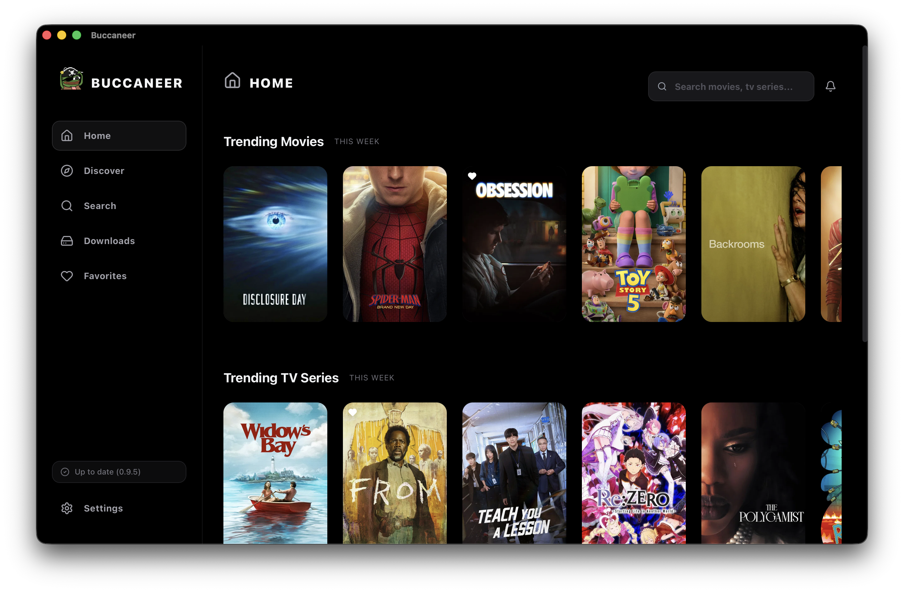
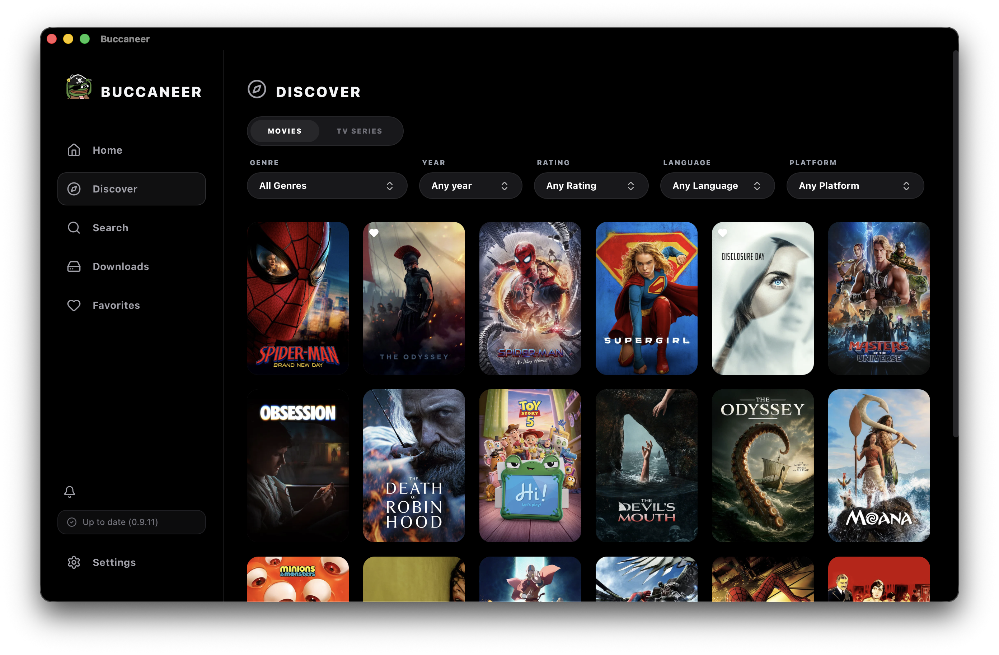
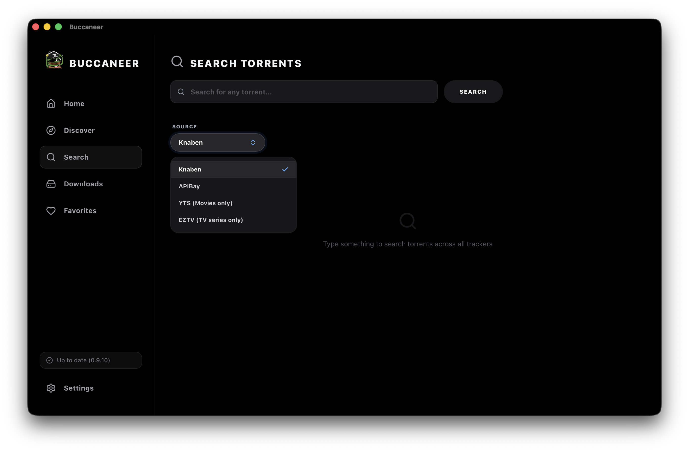
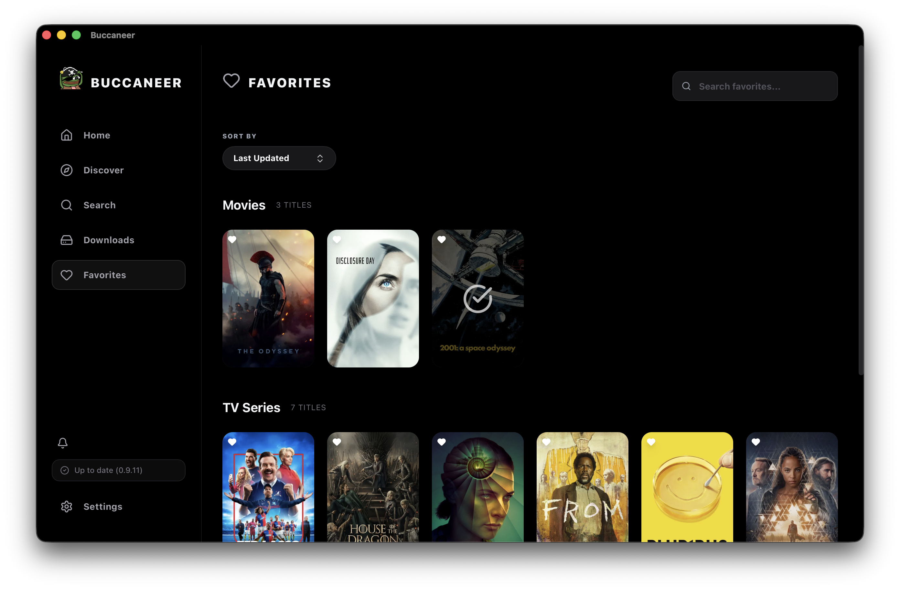

#  Buccaneer

**Buccaneer** is a modern, high-performance desktop application for discovering, streaming, and downloading movies and TV shows via BitTorrent. Built on **Tauri v2**, it combines a React frontend with a native Rust backend for a lightweight, secure, and fast experience.

---

## Screenshots

  

 

---

## Tech Stack

| Layer        | Technology                                                                 |
| ------------ | -------------------------------------------------------------------------- |
| **Frontend** | React 19, TypeScript 6, Vite 8, Tailwind CSS 3, React Router 7            |
| **Backend**  | Rust, Tauri v2 (2.11), librqbit 8.1.1 (torrent engine), reqwest, tokio    |
| **Torrents** | [librqbit](https://github.com/ikatson/rqbit) — embedded BitTorrent engine  |
| **Icons**    | Lucide React                                                              |
| **Animation**| Motion (Framer Motion v12)                                                |
| **Styling**  | Tailwind CSS with custom zinc/gray palette                                |
| **Persistence** | Tauri plugin-store (settings, favorites, watched history)              |

---

## Features

- **Torrent Search** — Multi-source search with smart fallback between providers.
- **Notification Bell** — Bell icon on HomePage shows new episodes for favorited TV series; click navigates directly to the show.
- **Stream & Download** — Stream in VLC or download with pause/resume and per-file selection within multi-file torrents.
- **TMDB Integration** — Trending, details, cast, trailers, ratings; full Discover by genre/year/platform.
- **TV Seasons & Episodes** — Episode browser, mark watched, quick-search across torrent sources.
- **Favorites & History** — Persistent library with watched tracking across sessions.
- **Settings** — API key, VLC path, speed limits, search filters, streaming providers, cleanup.
- **Crash Recovery** — Auto-cleanup of orphaned streaming files on startup.
- **Graceful Shutdown** — Confirms active downloads; optionally clears streamed files on exit.
- **Deep Links** — `buccaneer://` protocol support.
- **Auto-Updater** — In-app update checking with download progress bar and one-click install & restart.
- **Download Notifications** — OS-level notification when a torrent finishes downloading.

& much more.

---

## Installation

### Prerequisites per platform

| OS      | Requirements                                                                 |
| ------- | ---------------------------------------------------------------------------- |
| macOS   | Xcode Command Line Tools (`xcode-select --install`), Node.js 20+, Rust       |
| Windows | Visual Studio Build Tools (or VS with C++ workload), Node.js 20+, Rust       |
| Linux   | `libwebkit2gtk-4.1-dev`, `libappindicator3-dev`, `librsvg2-dev`, `patchelf`, `libssl-dev`, `libayatana-appindicator3-dev`, Node.js 20+, Rust |

### Build

```bash
git clone https://github.com/heiwin/Buccaneer.git
cd Buccaneer
npm install
npm run tauri build
```

The bundled app will be in `src-tauri/target/release/bundle/`.

---

## Download

Pre-built installers are available on the [releases page](https://github.com/heiwin/Buccaneer/releases).

| OS                     | Download                                                                                                                      |
| ---------------------- | ----------------------------------------------------------------------------------------------------------------------------- |
| **macOS** (Apple Silicon) | [`Buccaneer_0.9.9_aarch64.dmg`](https://github.com/heiwin/Buccaneer/releases/download/v0.9.9/Buccaneer_0.9.9_aarch64.dmg) |
| **macOS** (Intel Mac)     | [`Buccaneer_0.9.9_x64.dmg`](https://github.com/heiwin/Buccaneer/releases/download/v0.9.9/Buccaneer_0.9.9_x64.dmg)          |
| **Windows**               | [`Buccaneer_0.9.9_x64_en-US.msi`](https://github.com/heiwin/Buccaneer/releases/download/v0.9.9/Buccaneer_0.9.9_x64_en-US.msi) |
| **Linux**                 | [`Buccaneer_0.9.9_amd64.AppImage`](https://github.com/heiwin/Buccaneer/releases/download/v0.9.9/Buccaneer_0.9.9_amd64.AppImage) · [`Buccaneer_0.9.9_amd64.deb`](https://github.com/heiwin/Buccaneer/releases/download/v0.9.9/Buccaneer_0.9.9_amd64.deb) |

> **⚠️ macOS Unverified Developer Notice**
>
> The macOS `.dmg` builds are **not signed with an Apple Developer certificate** and will trigger a Gatekeeper warning when first opened.
>
> To open Buccaneer on macOS:
> 1. **Right-click** (or Ctrl+click) the app → **Open**
> 2. Click **Open** in the dialog
>
> Alternatively: **System Settings → Privacy & Security** → scroll down → click **Open Anyway** next to Buccaneer.
>
> These steps are only needed on the first launch.

---

## Key Design Decisions

1. **Backend-proxied network requests** — All TMDB and torrent API requests go through the Rust backend, not the frontend. This keeps API keys secure and allows server-side tracker filtering.

2. **Embedded librqbit HTTP API** — librqbit runs an HTTP API on `127.0.0.1` starting at port 3030, with automatic fallback up to 3049. The frontend communicates with it via Tauri commands that internally use the librqbit Rust API.

3. **Multi-source search** — Searches are routed across multiple torrent sources with automatic fallback when a source returns no results.

4. **In-memory TMDB cache** — TMDB responses are cached for 10 minutes using a simple in-memory Map. This prevents redundant API calls and improves perceived performance.

5. **Streaming via VLC** — Rather than building a custom video player, Buccaneer opens downloaded or in-progress files directly in VLC. This avoids complex transcoding, supports a wide range of formats (MKV, AVI, etc.) with native metadata and audio codec support.

6. **Graceful exit** — On close, the app checks for active torrents and prompts the user. On forced exit, it cleans up streaming files (unless disabled in settings). librqbit's persistence saves torrent state to disk so ongoing downloads resume after restart.

7. **Persistent state via plugin-store** — Settings, favorites, and watched history are persisted via `@tauri-apps/plugin-store` as JSON files in the app data directory. Library state auto-saves with a 500 ms debounce.

8. **Shared HTTP clients** — A `reqwest::Client` is reused across all TMDB and torrent API requests, with a separate client for the internal librqbit HTTP API. Both enable connection pooling and TLS session reuse.

---

## License

MIT — see the `LICENSE` file for details.

---

> **⚠️ Legal Disclaimer**
>
> Buccaneer is **built solely for educational and study purposes**. It is a personal project created to explore and demonstrate the technical capabilities of Tauri v2, React, and Rust — specifically around embedded BitTorrent engines, media streaming, and cross-platform desktop application architecture.
>
> The author **does not condone, encourage, or promote** piracy, copyright infringement, or any illegal activity. This software is not intended to be used for the unauthorized distribution or downloading of copyrighted material.
>
> **The author is not responsible** for the ways in which this software is used. Users assume all responsibility for ensuring that their use of Buccaneer complies with all applicable local, national, and international laws regarding copyright, torrenting, and digital media.
>
> By using or downloading this software, you acknowledge that:
> - You understand and agree to this disclaimer.
> - You will only use Buccaneer to access content that you have the legal right to access.
> - You are solely responsible for any legal consequences arising from your use of the software.
